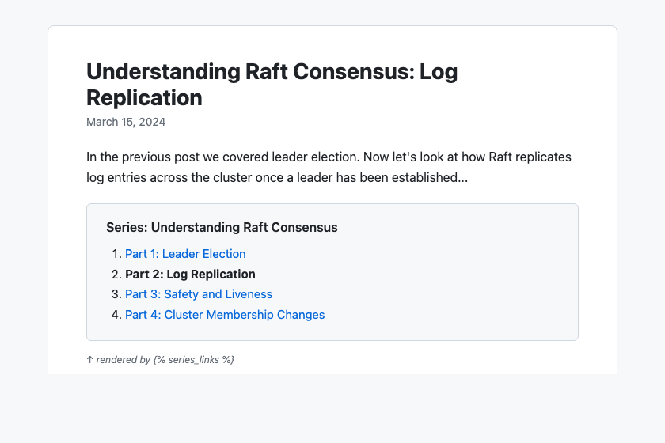

# jekyll-series-links



A Jekyll plugin that lets you organize blog posts into multi-part series. Posts declare their series membership via front matter, and a Liquid tag renders navigation links to all parts.

## Installation

Add the gem to your Jekyll site's `Gemfile`:

```ruby
gem "jekyll-series-links"
```

Then add it to the `plugins` list in your `_config.yml`:

```yaml
plugins:
  - jekyll-series-links
```

## Usage

### Front matter

Add `series` and `series_part` to each post in the series:

```yaml
---
title: "Getting Started with Widgets"
series: "Widget Mastery"
series_part: 1
---
```

```yaml
---
title: "Advanced Widget Techniques"
series: "Widget Mastery"
series_part: 2
---
```

### Rendering series navigation

Use the `` Liquid tag in your post layout to render a navigation list linking to all parts:

```liquid
{{ content }}


```

This produces HTML like:

```html
<nav class="series-nav">
  <h4>Series: Widget Mastery</h4>
  <ol>
    <li class="series-nav-item series-nav-current"><strong>Part 1: Getting Started with Widgets</strong></li>
    <li class="series-nav-item"><a href="/2026/01/15/advanced-widgets.html">Part 2: Advanced Widget Techniques</a></li>
  </ol>
</nav>
```

The current post is highlighted with the `series-nav-current` class and rendered as bold text instead of a link.

### Custom template

To override the default markup, create `_includes/series_links.html` in your site. The following variables are available in the template:

- `series_name` -- the name of the series
- `series_posts` -- an array of posts, each with `title`, `url`, and `part`

Example:

```liquid
<div class="my-series">
  <h3>{{ series_name }}</h3>
  <ul>
    
      <li><a href="{{ post.url }}">{{ post.title }}</a></li>
    
  </ul>
</div>
```

## Compatibility

- Ruby >= 2.5
- Jekyll >= 3.7, < 5.0

## License

[MIT](LICENSE)
